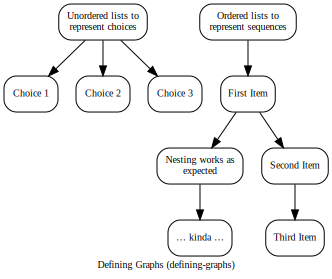
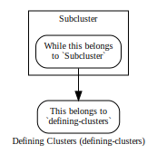
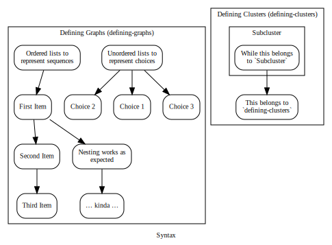

# markgraph.py – Turn outline lists into graphs #

This tool reads a text file line‐by‐line, and turns nested lists into graphs, rendering them using [graphviz][].

Dependencies:

* [Python] [] 2.7. Might also work with 3, haven't tested.
* [Graphviz] [] must be installed and the `dot` executable in the path.

[Python]: http://www.python.org
[Graphviz]: http://www.graphviz.org

Run `python markgraph.py -h` for usage notes.

## Syntax ##

### Defining Graphs (defining-graphs) ###

You can write unordered lists using `*`, `-`, or `+` as bullets; nesting implies graph edges. Ordered lists (1., 2.) work as well, but here, edges are defined by subsequent items, as well as nesting.

* [Unordered lists to represent choices](!)
    * /Choice 1/
    * /Choice 2/
    * /Choice 3/
* [Ordered lists to represent sequences](!)
    1. [First Item]()
        1. Nesting works as expected
        2. … kinda …
    2. Second Item
    3. Third Item

### Defining Clusters (defining-clusters) ###

To [visually group nodes](!Visually Grouping Nodes), markgraph turns [section headers] into (nested) [subgraphs]().  Be sure to include unique words in each section name you want to output.  See next section for the reason.

When you [Talk to Kevin](!) you can either [Help Kevin](), [Refuse to help Kevin]() or [Be non-commital to Kevin](). If you [Help Kevin](:) then [he calls the cops](). If you are [non-commital](:), he will [do something else]()

A node uniquely belongs to the cluster where it appears at the lowest nesting level.

* This belongs to `defining-clusters`

If you want the cluster label to linebreak at specific points, insert two spaces where the linebreak should go. The double spaces won't show up in the HTML-output, because HTML collapses spaces.

Thus

    # Some super-long headline  that might look too wide  in the resulting graph #

will render as

    Some super-long headline
    that might look too wide
     in the resulting graph

#### Subcluster ####

* While this belongs to `Subcluster`
    * This belongs to `defining-clusters`

### Referencing / Outputting Graphs (output) ###

To include a graph in your document, just mention a filename of the form `graph_substring.extension`, where `substring` is a part of a section you want to be the toplevel of the graph, and `extension` is an extension that graphviz

Since filenames with whitespace in them can behave wonkily, be sure to include a unique identifier (without whitespace) in each section.

While you only need to mention the name anywhere in the file, the idea is to include it in an ``‐tag or an ``.

So saying:

    

results in:

and

    

becomes

